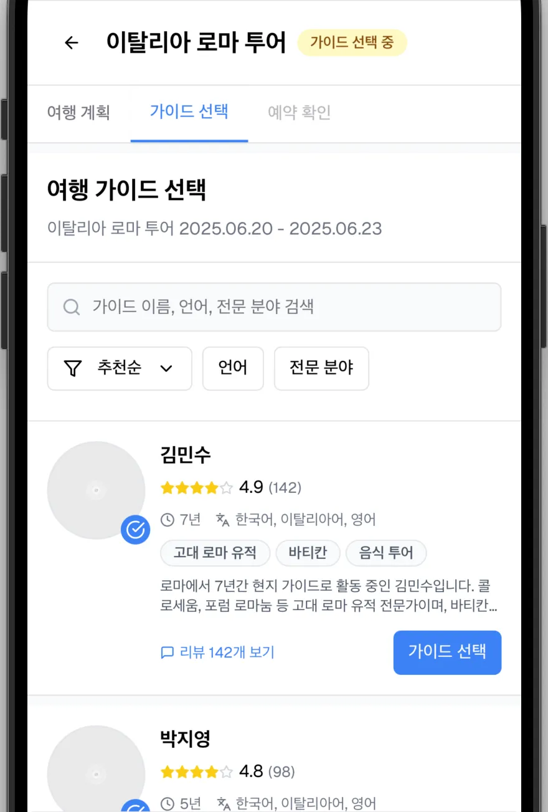
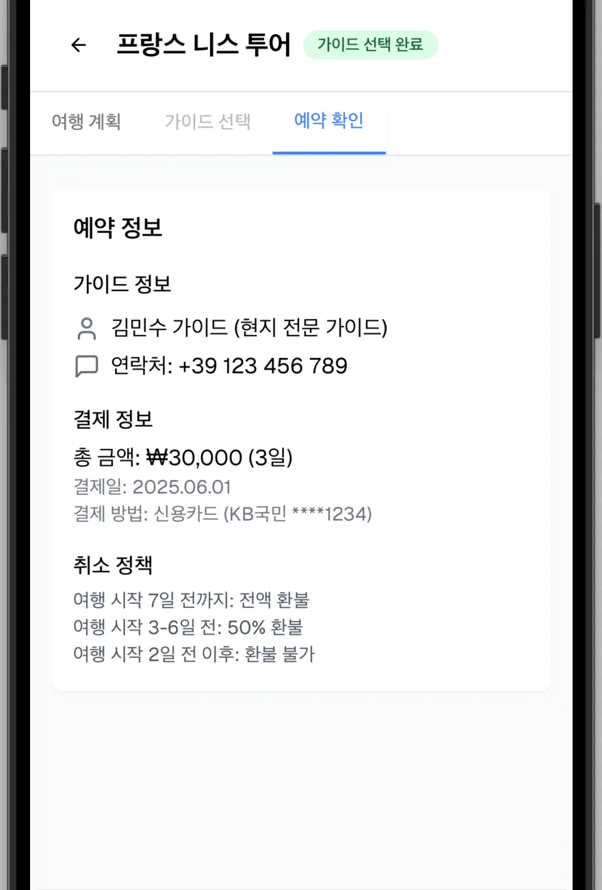
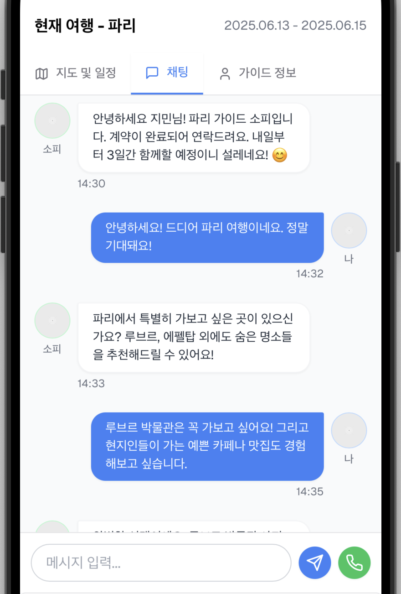
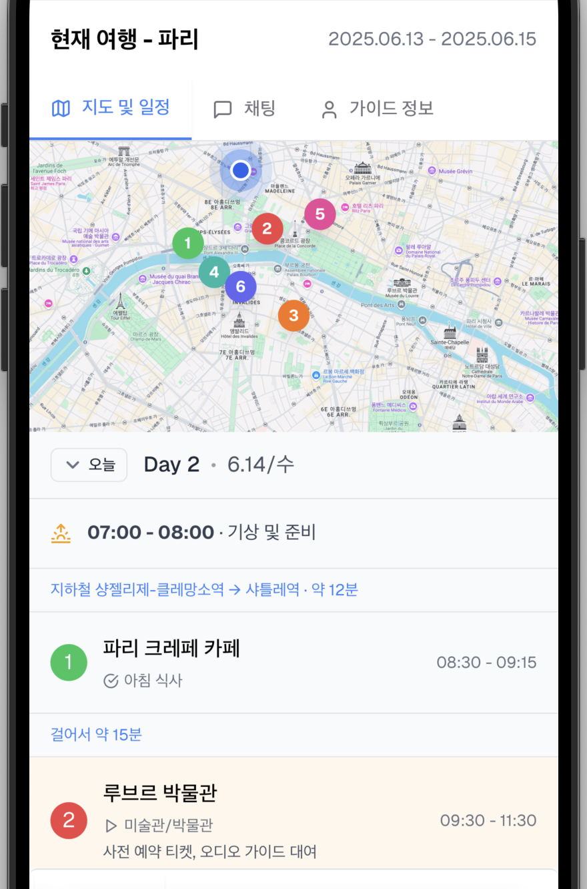
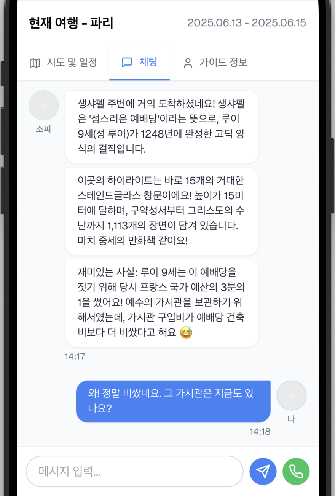
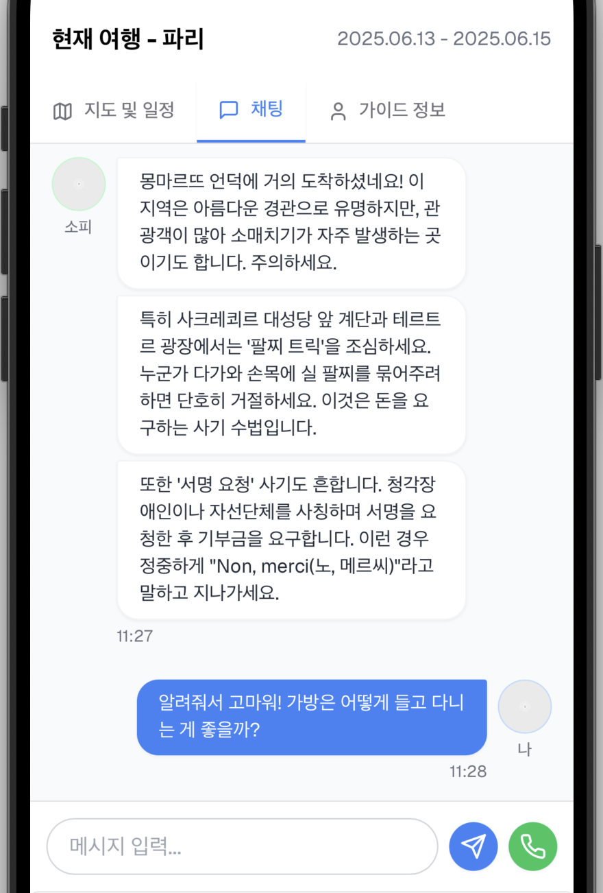
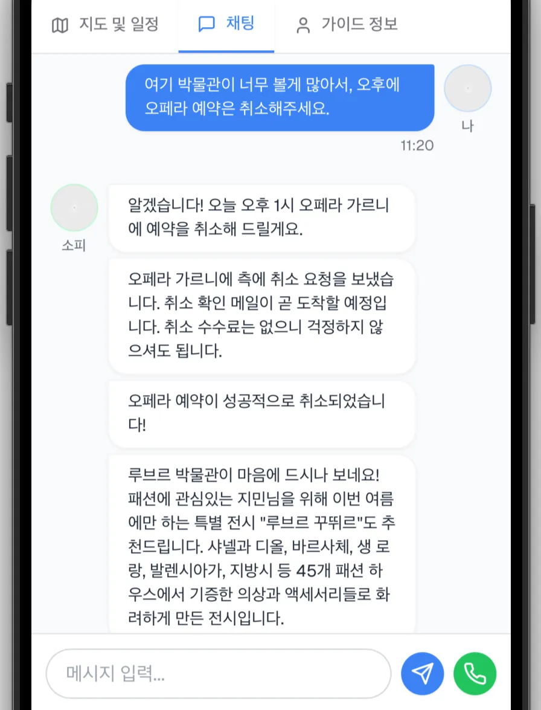
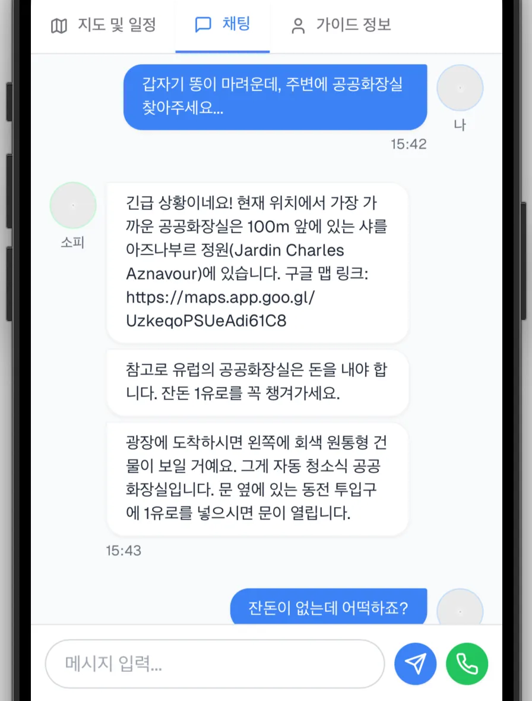
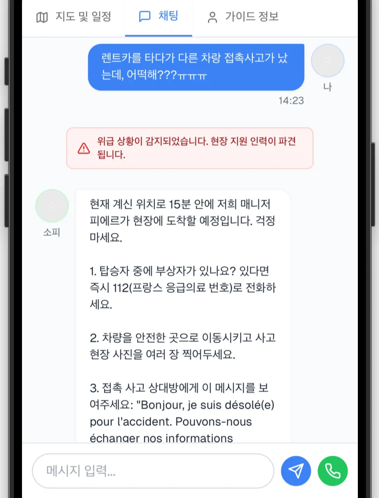
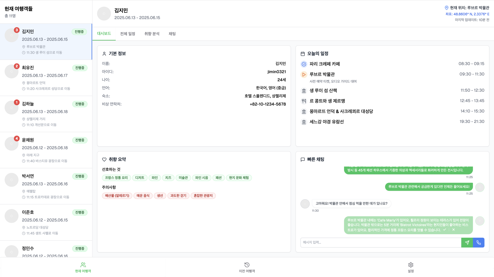

# TravelPal UI Demo

20\~30대 서유럽 자유여행객을 위한 비대면 가이드 서비스, **TravelPal**의 UI 데모입니다.
👉 [https://travelpal-ui-demo.vercel.app](https://travelpal-ui-demo.vercel.app)

TravelPal은 2025년 1학기 서울대학교 벤처창업론 강의의 팀 프로젝트로 기획되었고, 이 레포지토리는 TravelPal의 여행객과 가이드 양측의 UI 흐름을 모두 보여주는 Next.js 기반 **UI 데모**입니다.


[](https://nextjs.org/) [](https://react.dev/) [](https://tailwindcss.com/)
[](https://travelpal-ui-demo.vercel.app/)
[]()

## 🧩 문제 정의

여행객 입장에서는 기존 가이드 서비스가 가진 두 가지 문제점 때문에 가이드를 선뜻 선택하지 못했습니다:

* 자유로운 일정 불가 (단체 일정 중심)
* 낯선 사람과의 동행에 대한 불편함

가이드 입장에서도 다음과 같은 제약이 있었습니다:

* 실외 동행 중심의 피로도 높은 근무 환경
* 물리적 한계로 인해 제한된 고객 수

## 💡 솔루션

TravelPal은 여행객이 **채팅 기반으로 비대면 가이드 서비스를 받는 플랫폼**입니다.
여행객은 자유로운 여행을 유지하면서도 전문적인 도움을 받을 수 있으며,
가이드는 실내에 근무하며 다수의 여행객을 동시에 지원할 수 있습니다.


## 🧑‍🎒 여행객의 UI 흐름

### 1. 가이드 선택



여행객이 입력한 목적지와 기간에 맞는 가이드 목록이 표시되며, 각 가이드의 평점과 리뷰를 확인하여 선택할 수 있습니다.

### 2. 결제 및 계약

  

가이드 서비스는 1일 10,000원으로, 결제 후 계약이 완료됩니다.

### 3. 여행 준비

  

계약 완료 후 가이드가 먼저 연락하여 선호하는 여행지를 파악합니다. 이후 채팅을 통해 일정을 조율하고, 항공권, 식당, 교통, 입장권, 액티비티 등의 예약을 대행합니다. 모든 비용은 등록된 결제 수단으로 처리됩니다. 또 가이드는 필수 준비물과 사전 숙지사항을 안내해드립니다.

### 4. 일정 확인 및 지도 연동

  

여행 중에는 지도와 일정 탭에서 모든 일정을 한눈에 확인할 수 있으며, 이동 수단을 터치하면 구글 맵 경로로 즉시 연결됩니다.

### 5. 실시간 정보 제공

  

일정과 GPS 정보를 바탕으로 적시에 필요한 정보를 제공합니다.

### 6. 주의사항 안내

  

또 적시에 주의 사항을 제공합니다.

### 7. 일정 변경

  

일정 변경이 필요할 경우 채팅으로 신속하게 조정이 가능합니다.

### 8. 현지 맞춤 정보 제공

  

현지 한국인 가이드가 여행 중 마주할 수 있는 당황스러운 상황에 대해 실용적인 정보를 제공합니다.

### 9. 긴급 지원

  

긴급 상황 발생 시에는 가이드가 현장에 출동하여 직접 도움을 제공합니다.

## 🧑‍💼🗺️ 가이드의 UI 흐름

  

고객이 채팅을 보내거나 새로운 장소로 이동하면, 가이드의 사이드바에서 해당 고객이 상단으로 자동 정렬됩니다. 가이드는 대시보드에서 고객의 기본 정보, 당일 일정, 취향 및 주의사항 요약을 한눈에 확인할 수 있어 빠르고 정확한 응답이 가능합니다.

채팅창에는 자동 완성 기능이 탑재되어 있어 반복적인 질문에 효율적으로 대응할 수 있습니다.
고객의 메시지나 위치 변경이 감지되면, 흐릿한 채팅 버블 형태로 자동 응답 제안이 표시되고, 가이드는 이를 수락(✅)하거나 거절(❌)할 수 있습니다. 이 제안은 여행객의 채팅 기록, 여행 일정, 현재 위치, 취향, 특이사항 등을 LLM이 종합적으로 분석해 생성합니다. 가이드가 이러한 제안을 수용하거나 새롭게 답변을 작성하는 과정을 반복함에 따라, LLM은 점차 가이드의 응대 스타일에 맞게 최적화(fine-tune)됩니다.

이 시스템을 통해 가이드는 더 많은 고객을 동시에 응대할 수 있으며, 야외가 아닌 실내에서도 안정적으로 근무할 수 있습니다.

## 🆚 기존 서비스와의 비교

| 항목 | 기존 플랫폼 (MyRealTrip의 가이드 서비스 등) | TravelPal |
| ------ | ------ | ------ |
| 가이드 형태 | 오프라인 동행 | 채팅 기반 비대면 |
| 일정 자유도 | 낮음 | 높음 |
| 사람이 따라다닌다는 불편함 | 있음 | 없음 |
| 비용 | 상대적으로 높음 | 10,000원/일 |
| 정보 신뢰성 | 높음 | 동일 수준 (기존 가이드 대상 리크루팅) |
| 응급 대응 | 물리적 대응 | 채팅 + 제한적 현장 지원 |
| (가이드 입장) 동시 수용 가능 고객 | 제한적 | LLM 기반 자동 응답을 통한 scale 달성 |

## 🛠️ 프로젝트 구조

```bash
.
├── app/                # 페이지 라우팅
│   ├── guide/          # 가이드 전용 페이지
│   └── traveler/       # 여행객 전용 페이지
├── components/         # 공통 및 페이지별 컴포넌트
│   ├── guide/          # 가이드 기능 UI
│   ├── traveler/       # 여행객 기능 UI
│   ├── layout/         # 헤더 및 테마 관련
│   └── ui/             # 버튼, 모달 등 공통 UI
├── hooks/              # 커스텀 훅
├── lib/                # 데이터/상태 관련 유틸
├── public/             # 이미지 및 정적 파일
├── styles/             # 글로벌 스타일
```

## 📄 라이선스

이 프로젝트는 [MIT License](LICENSE)에 따라 라이선스가 부여됩니다.